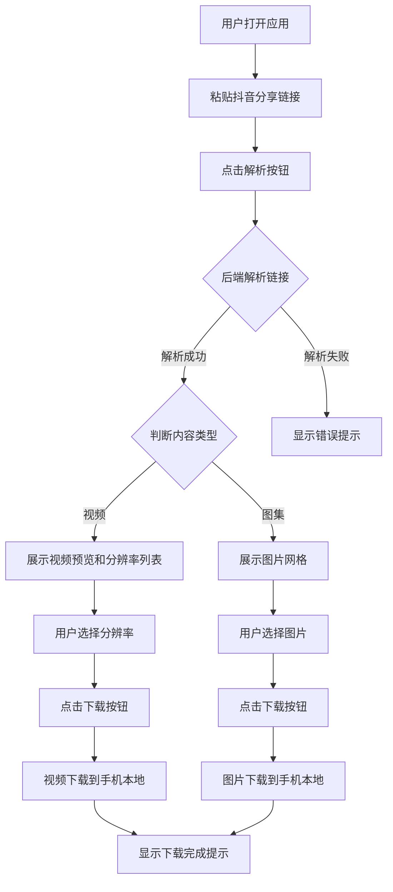

## 1. 产品概述

抖音下载器是一款面向安卓手机的 PWA（渐进式 Web 应用），用户通过粘贴抖音分享链接，即可解析并下载抖音视频（支持多分辨率选择）和抖音图片到手机本地存储。

- **目标用户**：希望保存抖音视频和图片到手机本地的普通用户
- **核心价值**：无需安装第三方 APK，通过浏览器即可快速下载抖音内容，操作简单、安全可靠

## 2. 核心功能

### 2.1 用户角色

| 角色 | 注册方式 | 核心权限 |
|------|---------|---------|
| 普通用户 | 无需注册 | 粘贴链接、解析内容、选择分辨率、下载视频/图片 |

### 2.2 功能模块

1. **链接解析页**：输入框粘贴抖音链接、解析按钮、解析结果展示区
2. **视频下载模块**：视频预览、分辨率选择列表、下载按钮
3. **图片下载模块**：图片预览、单张/批量下载按钮

### 2.3 页面详情

| 页面名称 | 模块名称 | 功能描述 |
|---------|---------|---------|
| 首页 | 链接输入区 | 提供输入框，支持用户粘贴抖音分享链接（含剪切板一键粘贴） |
| 首页 | 解析按钮 | 点击后调用后端 API 解析链接，提取视频/图片资源 |
| 首页 | 内容类型识别 | 自动识别链接类型（视频或图集），展示对应下载界面 |
| 首页 | 视频预览区 | 展示视频封面缩略图、标题、时长等信息 |
| 首页 | 分辨率选择器 | 列出可用分辨率（如 720p、1080p），用户点击选择 |
| 首页 | 视频下载按钮 | 点击后将选中分辨率的视频下载到手机本地 |
| 首页 | 图片预览区 | 以网格形式展示图集中的所有图片 |
| 首页 | 图片下载按钮 | 支持单张下载和批量下载全部图片 |
| 首页 | 下载状态提示 | 显示下载进度、完成提示或错误信息 |

## 3. 核心流程

## 4. 用户界面设计

### 4.1 设计风格

- **主题风格**：暗色主题为主，灵感来源于抖音品牌色（黑底 + 霓虹粉/青渐变点缀），营造潮流科技感
- **主色调**：深黑背景 `#0D0D0D`，霓虹粉 `#FF0050`，电光青 `#00F2EA`
- **按钮风格**：圆角胶囊按钮，渐变色填充，带发光阴影效果
- **字体**：标题使用有力量感的无衬线字体，正文使用清晰易读的字体
- **布局风格**：单页面设计，卡片式内容区，移动端优先适配
- **图标风格**：线性图标，使用 lucide-react 图标库

### 4.2 页面设计概览

| 页面名称 | 模块名称 | UI 元素 |
|---------|---------|---------|
| 首页 | 顶部品牌区 | 霓虹渐变 Logo 文字，副标题，发光装饰线 |
| 首页 | 链接输入区 | 圆角卡片容器，输入框带内发光边框，一键粘贴图标按钮 |
| 首页 | 解析按钮 | 全宽渐变胶囊按钮，hover 时发光增强动画 |
| 首页 | 视频结果区 | 卡片容器，视频封面带圆角和阴影，标题文字，时长标签 |
| 首页 | 分辨率选择器 | 横向滚动的标签列表，选中态高亮发光，非选中态半透明 |
| 首页 | 下载按钮 | 霓虹粉渐变按钮，带下载图标，点击有波纹动画 |
| 首页 | 图片结果区 | 2 列网格布局，圆角缩略图，底部半透明遮罩层 |
| 首页 | 状态提示 | Toast 弹窗提示，成功/失败不同配色 |

### 4.3 响应式设计

- **移动端优先**：以 375px-428px 宽度为基准设计，适配主流安卓手机屏幕
- **平板适配**：在较大屏幕上图片网格扩展为 3-4 列
- **触控优化**：按钮最小点击区域 44x44px，间距充足防止误触

## 5. 技术约束

- 抖音无公开 API，需通过服务端模拟请求解析分享页面获取真实资源 URL
- 跨域视频资源需通过服务端代理或配置 CORS 处理
- 大文件下载需支持断点续传和进度反馈
- PWA 需配置 Service Worker 支持离线缓存和添加到主屏幕