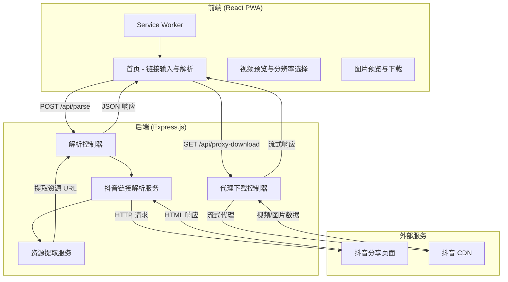
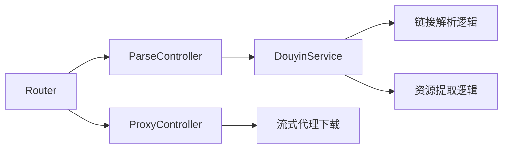

## 1. 架构设计



## 2. 技术描述

- **前端**：React@18 + TypeScript + Tailwind CSS@3 + Vite
- **状态管理**：Zustand
- **路由**：react-router-dom（单页应用）
- **初始化工具**：vite-init（react-express-ts 模板）
- **后端**：Express@4 + TypeScript
- **HTTP 客户端**：axios（服务端请求抖音页面）
- **HTML 解析**：cheerio（解析抖音分享页 HTML）
- **图标库**：lucide-react
- **PWA**：vite-plugin-pwa

## 3. 路由定义

| 路由 | 用途 |
|------|------|
| / | 首页，包含链接输入、内容解析、视频/图片下载全部功能 |

## 4. API 定义

### 4.1 解析链接

```typescript
// POST /api/parse
interface ParseRequest {
  url: string; // 抖音分享链接
}

interface VideoResource {
  type: 'video';
  title: string;
  cover: string;
  duration: number;
  author: string;
  resolutions: {
    label: string;   // "720p", "1080p"
    url: string;     // 代理下载地址
    width: number;
    height: number;
  }[];
}

interface ImageResource {
  type: 'image';
  title: string;
  author: string;
  images: {
    url: string;       // 代理下载地址
    thumb: string;     // 缩略图
    width: number;
    height: number;
  }[];
}

type ParseResponse = {
  success: true;
  data: VideoResource | ImageResource;
} | {
  success: false;
  error: string;
};
```

### 4.2 代理下载

```typescript
// GET /api/proxy-download?url=<encoded_url>&filename=<filename>
// 响应: 二进制流 (Content-Type: video/mp4 或 image/jpeg)
// 用于绕过跨域限制，直接代理下载资源
```

## 5. 服务端架构



## 6. 数据模型

本项目无需持久化数据库，所有数据在请求-响应周期内处理。前端使用 Zustand 管理临时状态：

```typescript
// 前端状态
interface AppState {
  inputUrl: string;
  isLoading: boolean;
  parseResult: VideoResource | ImageResource | null;
  error: string | null;
  selectedResolution: string | null;
  downloadProgress: number;
  setInputUrl: (url: string) => void;
  setParseResult: (result: VideoResource | ImageResource | null) => void;
  setLoading: (loading: boolean) => void;
  setError: (error: string | null) => void;
  setSelectedResolution: (label: string) => void;
  setDownloadProgress: (progress: number) => void;
  reset: () => void;
}
```